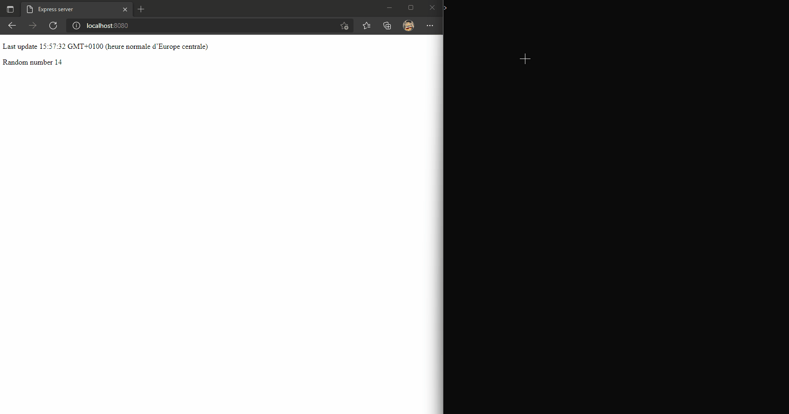

# Socket.io Express

A simple express project to learn how to use socket.io ✨

### 👶 Simple project

This is a small project that has been designed to be usable by everyone.

The objective of this project is to edit the data of a web page.

In this example, I chose to refresh this data every second :

- The last uptime
- A random number

The strong features of the method used :

- Updates without reloading the page
- Even after a restart or an interruption the data will be updated on restart

Realized with ❤️ by [ZerioDev](https://github.com/ZerioDev).